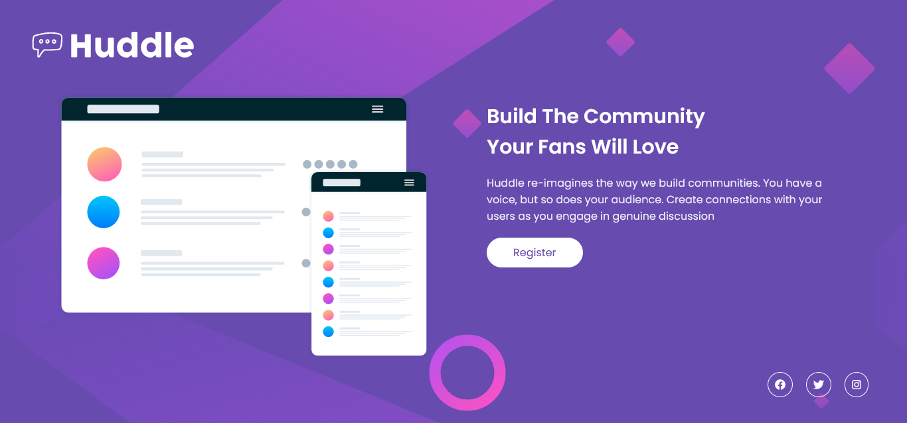

# Frontend Mentor - Huddle landing page with single introductory section solution

This is a solution to the [Huddle landing page with single introductory section challenge on Frontend Mentor](https://www.frontendmentor.io/challenges/huddle-landing-page-with-a-single-introductory-section-B_2Wvxgi0). Frontend Mentor challenges help you improve your coding skills by building realistic projects.

## Table of contents

- [Overview](#overview)
  - [The challenge](#the-challenge)
  - [Screenshot](#screenshot)
  - [Links](#links)
  - [Built with](#built-with)
  - [What I learned](#what-i-learned)
- [Author](#author)

## Overview

### The challenge

Users should be able to:

- View the optimal layout for the page depending on their device's screen size
- See hover states for all interactive elements on the page

### Screenshot



### Links

- Solution URL: [GitHub repository](https://github.com/WadieBenabdouh/repo-one)
- Live Site URL: [Live preview](https://wadiebenabdouh.github.io/repo-one/)

### Built with

- Semantic HTML5 markup.
- Flexbox.
- Desktop-first workflow.

### What I learned

CSS Flexbox is really handy when it comes to laying out a webpage.

Proud of these code lines >

```html
      <div class="description">
        <h2>Build The Community Your Fans Will Love</h2>
        <p>Huddle re-imagines the way we build communities. You have a voice, but so does your audience. Create connections with your users as you engage in genuine discussion</p>
        <a class="button" href="#">Register</a>
      </div>
```

```css
.section-container{
    display: flex;
    justify-content: space-evenly;
}
```

## Author

- Frontend Mentor - [@Wadie Benabdouh](https://www.frontendmentor.io/profile/WadieBenabdouh)

- Twitter - [@BenabdouhWadie](https://twitter.com/BenabdouhWadie)
